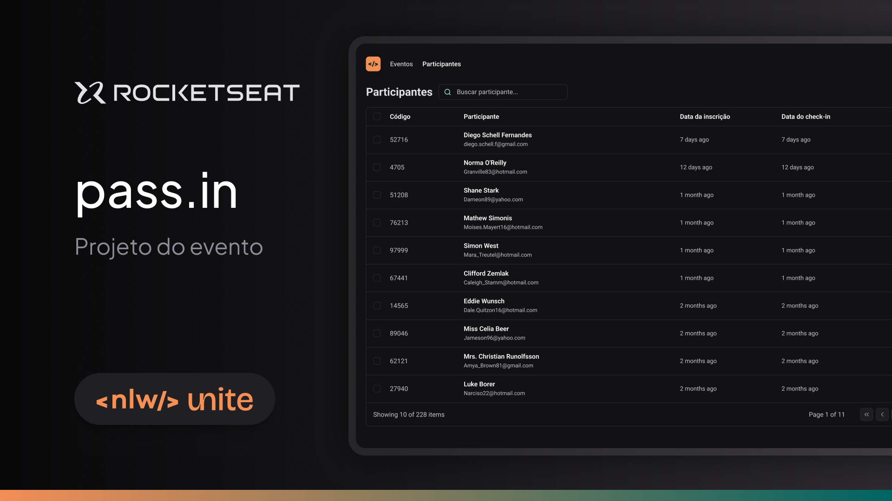

<h1 align="center" style="font-weight: bold;">pass.in</h1>

<p align="center">
  <a href="#technologies">Technologies</a> • 
  <a href="#requirements">Requirements</a> • 
  <a href="#started">Getting Started</a> • 
  <a href="#documentation">API Documentation</a>
</p>

<p align="center">The pass.in is an application for <b>attendee management in in-person events.</b></p>

<p align="center">The tool allows the organizer to register an event and open a public registration page.</p>

<p align="center">Registered attendees can generate a credential for check-in on the day of the event.</p>

<p align="center">The system will scan the attendee's credential to allow entry to the event.</p>

<div align="center">
  
</div>

<h2 id="technologies">Technologies</h2>

<h3>Front-end</h3>

- ReactJs
- Typescript
- Tailwindcss
- TanStack Query
- React Router


<h3>Back-end</h3>

- NodeJs
- Typescript
- Fastify
- Docker
- Prisma
- Postgres
- Zod
- Swagger

<h2 id="requirements">Requirements</h2>

### Functional Requirements

- [x] The organizer must be able to register a new event;
- [x] The organizer must be able to view event data;
- [x] The organizer must be able to view the list of attendees;
- [x] The attendee must be able to register for an event;
- [x] The attendee must be able to view their registration badge;
- [x] The attendee must be able to check-in at the event;

### Business Rules

- [x] The attendee can only register for an event once;
- [x] The attendee can only register for events with available spots;
- [x] The attendee can only check-in to an event once;

### Non-functional Requirements

- [x] Event check-in will be done through a QRCode;

<h2 id="started">Getting started</h2>

<h3>Prerequisites</h3>

- [NodeJS](https://nodejs.org/en)
- [Docker](https://www.docker.com/)

<h3>Cloning the project</h3>

```bash
git clone https://github.com/adrianmouzinho/nlw-unite.git
```

<h3>Starting Back-end (API)</h3>

> Before executing the API, rename the .env.example file to .env and, if necessary, change the DATABASE_URL variable.

> You must also run migrations to create database tables and run the seed to populate the database with fake data.

```sh
cd server
pnpm i
docker compose up -d
pnpm run db:migrate
pnpm run db:seed
pnpm run dev
```

<h3>Starting Front-end</h3>

> Before executing the react app, rename the .env.example file to .env and, if necessary, change the VITE_API_URL variable.

```sh
cd web
pnpm i
pnpm run dev
```

<h2 id="documentation">API Documentation (Swagger)</h2>

For API documentation, access the link: [https://nlw-unite-nodejs.onrender.com/docs](https://nlw-unite-nodejs.onrender.com/docs)
